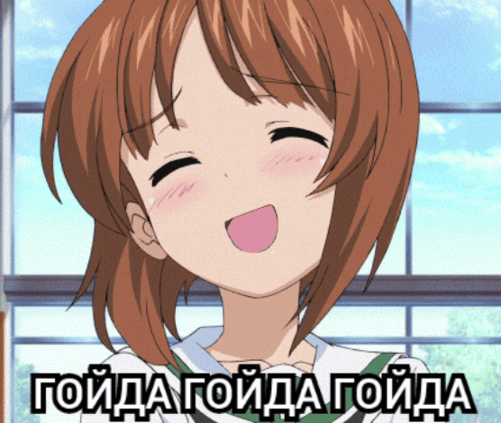

# Практическое задания №1 «Теоретико-множественные операции»

## Задание
>Вар 2
>Написать на языке С/C++/Python и отладить программу,
>реализующую следующие функции:
>-Задание множества десятичных чисел;
>-Перевод из десятичной в двоичную систему исчисления;
>-Вывод элементов 2-х множеств;

Выполнил: студент группы ИУ4-23Б 
Калиниченко В. В.

